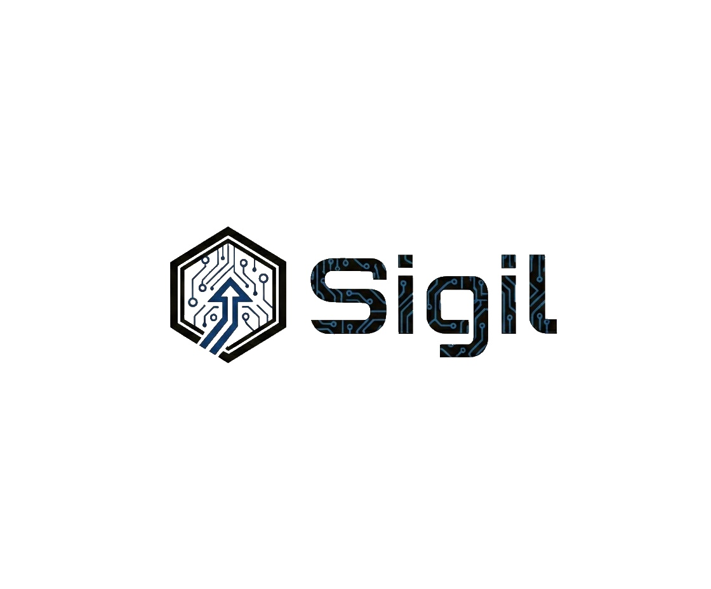

# Sigil — Crowd Wisdom Stock Discovery

**Feature Specification Document**

**Version:** 1.1  
**Date:** February 12, 2026  
**Author:** PM Agent, Blaze Neon  
**Status:** Ready for Development  

---

## Implementation Tickets (Linear)

### 🎯 Simplified MVP: Weekly Top 5 Smart Money Picks

| Ticket | Title | Priority | Complexity | Status |
|--------|-------|----------|------------|--------|
| [REC-265](https://linear.app/rectrader/issue/REC-265) | **Weekly Top 5 Smart Money Picks** | P1 | Medium | ⭐ NEW |
| [REC-251](https://linear.app/rectrader/issue/REC-251) | OpenInsider Data Fetcher | P1 | Medium | MVP |
| [REC-252](https://linear.app/rectrader/issue/REC-252) | Insider Transactions Storage Schema | P1 | Low | MVP |
| [REC-253](https://linear.app/rectrader/issue/REC-253) | Insider Signal Scoring | P1 | Medium | MVP |
| [REC-254](https://linear.app/rectrader/issue/REC-254) | Crowd Wisdom API Endpoints | P1 | Low | MVP |
| [REC-261](https://linear.app/rectrader/issue/REC-261) | iOS Models for Crowd Wisdom | P2 | Low | MVP |
| [REC-259](https://linear.app/rectrader/issue/REC-259) | Top 5 Section in Home View | P2 | Low | MVP |

### 📦 Phase 2: Enhanced (Post-MVP)
| Ticket | Title | Priority | Status |
|--------|-------|----------|--------|
| [REC-255](https://linear.app/rectrader/issue/REC-255) | Superinvestor Registry | P3 | Deferred |
| [REC-256](https://linear.app/rectrader/issue/REC-256) | SEC EDGAR 13F Parser | P3 | Deferred |
| [REC-257](https://linear.app/rectrader/issue/REC-257) | CUSIP to Ticker Mapping | P3 | Deferred |
| [REC-258](https://linear.app/rectrader/issue/REC-258) | Institutional Signal Scoring | P3 | Deferred |
| [REC-260](https://linear.app/rectrader/issue/REC-260) | Detail View Integration | P3 | Deferred |
| [REC-262](https://linear.app/rectrader/issue/REC-262) | Weekly Cron Job | P3 | Deferred |
| [REC-263](https://linear.app/rectrader/issue/REC-263) | Score Boost Integration | P3 | Deferred |
| [REC-264](https://linear.app/rectrader/issue/REC-264) | Discovery Filters | P3 | Deferred |

**MVP: 7 tickets | Post-MVP: 8 tickets deferred**

---

## Lean UX Approach

**Principle:** Cherry pick top 5 stocks weekly. Maximum signal, minimal UI.

### MVP Output:
```
Every Sunday → Top 5 Smart Money Picks
- Filter: Tech sector + Price < $30
- Rank: By insider buying strength
- Display: Simple list in Home View
```

### What We're Building (MVP):
1. **"Weekly Smart Money Picks" section on Home** — Card showing top 5 stocks with strongest insider buying
2. That's it. One section. One list.

### What We're NOT Building (Deferred):
- ❌ Badge on every stock card
- ❌ Crowd wisdom section in stock detail
- ❌ Superinvestor tracking (13F)
- ❌ Score boost integration
- ❌ Complex filters

**MVP UI = 1 section showing 5 stocks.**

---

## Table of Contents

1. [Problem Statement](#1-problem-statement)
2. [Goal](#2-goal)
3. [Sources Analysis](#3-sources-analysis)
4. [Comparison Table](#4-comparison-table)
5. [Recommended Sources](#5-recommended-sources)
6. [Data to Parse](#6-data-to-parse)
7. [Implementation Plan](#7-implementation-plan)
8. [Constraints](#8-constraints)
9. [Filter Criteria](#9-filter-criteria)
10. [Weekly Output Format](#10-weekly-output-format)

---

## 1. Problem Statement

### Why We Need Crowd Wisdom / Smart Money Signals

Sigil currently scores stocks using four quantitative pillars: **Fundamentals (35%)**, **Sentiment (25%)**, **Macro (20%)**, and **Technical (20%)**. While this provides a solid foundation for stock ranking, it misses a critical dimension that sophisticated investors use: **what are the smartest investors actually buying?**

#### The Missing Signal

1. **Institutional Blind Spot**: Hedge funds managing billions of dollars employ armies of analysts and have access to information networks retail investors don't. When Renaissance Technologies, Berkshire Hathaway, or Tiger Global takes a large position, it signals conviction that fundamentals alone may not capture.

2. **Insider Knowledge Gap**: Corporate insiders (CEOs, CFOs, directors) know their businesses better than any external analyst. When insiders buy stock with their own money, it's a powerful bullish signal. Sigil currently has no visibility into this.

3. **Social Alpha**: Retail investors on Reddit's r/ValueInvesting and r/stocks occasionally identify undervalued opportunities before Wall Street. The "wisdom of crowds" can surface hidden gems, especially in small/mid-cap tech.

4. **Sentiment Depth**: Our current sentiment score relies on news headlines. But the most actionable sentiment often lives in FinTwit discussions, StockTwits threads, and community forums where investors debate in real-time.

### Current Gap in Sigil's Scoring Pipeline

| Current Pipeline Component | Data Source | What It Misses |
|---------------------------|-------------|----------------|
| Fundamental Score | Yahoo Finance, SEC | Institutional conviction, smart money flows |
| Sentiment Score | RSS Feeds, News APIs | Real-time social sentiment, community consensus |
| Technical Score | Price data | Volume anomalies from institutional accumulation |
| Macro Score | FRED | Sector rotation signals from fund managers |

**The Gap**: Sigil knows what the *numbers* say, but not what the *smartest money* is doing.

### Why This Matters for Our Target User

The "Busy Builder" — our 30-40 year old tech professional — doesn't have time to:
- Read 13F filings manually
- Track insider transactions across 800 stocks
- Monitor Reddit threads for emerging consensus
- Follow 50 FinTwit accounts

Sigil should do this automatically and surface the signal.

---

## 2. Goal

### What We Want to Achieve

**Primary Goal**: Enhance Sigil's scoring pipeline with a "Crowd Wisdom" component that captures institutional/smart money signals and social sentiment, enabling discovery of high-conviction opportunities that pure quantitative analysis misses.

**Secondary Goals**:
1. **Stock Discovery**: Surface interesting tech stocks that may not be in our current 677-stock universe but are attracting smart money attention
2. **Score Enhancement**: Add a 5th scoring component or boost existing scores when crowd wisdom aligns
3. **Explainability**: Tell users *why* smart money is interested ("Buffett added 50% to position", "3 insiders bought in last 30 days")

### Success Metrics

| Metric | Target | Measurement |
|--------|--------|-------------|
| Alpha Contribution | +2% annual return vs. baseline model | Backtest crowd wisdom signals |
| Signal Accuracy | >60% of "smart money buy" signals positive after 90 days | Track forward returns |
| Data Freshness | <48 hours from 13F filing to score update | Monitor pipeline lag |
| Coverage | 100% of 677 stock universe has crowd wisdom data | Audit weekly |
| User Engagement | 30% of users view "Why Smart Money Likes This" | Analytics event tracking |

### Feature Naming

**User-Facing Name**: "Smart Money Signals" or "Institutional Interest"  
**Internal Name**: `crowd_wisdom` / `F2.7 Crowd Wisdom Score`

---

## 3. Sources Analysis

### 3.1 WhaleWisdom (13F Filings)

**URL**: https://whalewisdom.com

**What Data It Provides**:
- Aggregated 13F filings from institutional investors (hedge funds, mutual funds)
- Portfolio holdings for ~5,000+ institutions
- Quarter-over-quarter position changes
- "SuperInvestor" tracking (Buffett, Ackman, Druckenmiller, etc.)
- Heat maps showing most-bought/most-sold stocks
- Put/call ratio analysis

**API Availability**: **YES** (Paid)

**Cost**: **PAID**
- Basic: ~$50/month (limited API calls)
- Professional: ~$150/month (full API access)
- Enterprise: Custom pricing

**Reliability Rating**: ⭐⭐⭐⭐⭐ (5/5)

**Pros**:
- Clean, normalized 13F data
- Pre-built superinvestor tracking
- Excellent data quality
- Historical data back to 2004
- REST API available

**Cons**:
- Expensive for a bootstrapped project
- 13F filings are 45 days delayed (regulatory lag)
- Only covers positions >$100M AUM
- API has rate limits

---

### 3.2 Dataroma (Superinvestor Portfolios)

**URL**: https://www.dataroma.com/m/home.php

**What Data It Provides**:
- Curated list of ~70 superinvestors' portfolios
- Latest quarter holdings with position sizes
- Buy/sell activity ("New Buy", "Add", "Reduce", "Sell Out")
- Activity summaries ("Most Bought This Quarter")
- Individual manager pages with full portfolio

**API Availability**: **NO** (Scraping required)

**Cost**: **FREE**

**Reliability Rating**: ⭐⭐⭐⭐ (4/5)

**Pros**:
- Completely free
- Curated superinvestor list (quality over quantity)
- Clean HTML structure (easy to scrape)
- Updates promptly after 13F filings
- Focus on value investors (Buffett-style)

**Cons**:
- No official API — must scrape
- Limited to ~70 managers (not comprehensive)
- No historical data beyond current quarter
- Scraping may violate ToS (gray area)
- Site could change structure without notice

---

### 3.3 OpenInsider (Insider Trading)

**URL**: http://openinsider.com

**What Data It Provides**:
- Real-time SEC Form 4 filings (insider transactions)
- Insider buys and sells by company
- Cluster buying alerts (multiple insiders buying)
- Transaction details (price, shares, value, ownership %)
- Filterable by transaction type, size, sector

**API Availability**: **NO** (Scraping required, but RSS available)

**Cost**: **FREE**

**Reliability Rating**: ⭐⭐⭐⭐⭐ (5/5)

**Pros**:
- Completely free
- Near real-time data (within hours of SEC filing)
- RSS feed available for automation
- Clean tabular data (easy to parse)
- Insider buying is a proven alpha signal
- No 45-day delay like 13F

**Cons**:
- No official API (scrape or RSS)
- Noise: insiders sell for many reasons (taxes, diversification)
- Focuses on buys (sells are less informative)
- Limited enrichment (just raw transaction data)

---

### 3.4 Finviz (Screener)

**URL**: https://finviz.com

**What Data It Provides**:
- Stock screener with 70+ filters
- Insider trading summary per stock
- Institutional ownership percentage
- News aggregation
- Technical charts and patterns
- Analyst ratings

**API Availability**: **NO** (Elite subscription has limited export)

**Cost**: **FREEMIUM**
- Free: Basic screener, delayed data
- Elite: $39.50/month (real-time, more exports)

**Reliability Rating**: ⭐⭐⭐⭐ (4/5)

**Pros**:
- Excellent screener functionality
- Combines fundamentals + technicals + ownership
- Free tier is quite capable
- Visual pattern recognition
- Well-organized data tables

**Cons**:
- No real API (Elite has CSV export)
- Scraping against ToS
- Aggregated data (not raw filings)
- Limited historical data on free tier

---

### 3.5 Reddit (r/ValueInvesting, r/stocks)

**URL**: https://reddit.com/r/ValueInvesting, https://reddit.com/r/stocks

**What Data It Provides**:
- User-generated stock analysis and DD (due diligence)
- Discussion threads on specific tickers
- Sentiment from comments (bullish/bearish)
- Trending tickers and themes
- "Hidden gem" discoveries from retail

**API Availability**: **YES** (Reddit API, but recently restricted)

**Cost**: **FREE → PAID** (as of 2023)
- Free tier: Very limited (100 queries/minute for authenticated)
- Paid tier: $0.24 per 1K API calls (expensive at scale)

**Reliability Rating**: ⭐⭐⭐ (3/5)

**Pros**:
- Real-time sentiment from retail investors
- Occasionally surfaces undervalued stocks before institutions
- Community quality control (upvotes/downvotes)
- Natural language analysis can extract conviction

**Cons**:
- API pricing changed in 2023 (expensive at scale)
- Signal-to-noise ratio is poor (lots of memes, spam)
- Retail is often wrong (momentum chasing)
- Moderation varies by subreddit
- Requires NLP to extract meaningful signal

---

### 3.6 Twitter/X (FinTwit)

**URL**: https://x.com

**What Data It Provides**:
- Real-time commentary from finance professionals
- Breaking news and analysis
- Stock picks from influential accounts
- Sentiment from replies and engagement
- Trending tickers via cashtags ($AAPL)

**API Availability**: **YES** (X API v2, heavily restricted)

**Cost**: **PAID**
- Basic: $100/month (limited access)
- Pro: $5,000/month (full firehose)

**Reliability Rating**: ⭐⭐ (2/5)

**Pros**:
- Real-time, no lag
- High-quality accounts exist (Kuppy, Druck Jr., etc.)
- Cashtag tracking possible
- Engagement metrics show conviction

**Cons**:
- Extremely expensive API since Elon acquisition
- Bots and spam rampant
- Pump-and-dump schemes common
- Influencer bias (paid promotions)
- Rate limits are punishing

---

### 3.7 StockTwits

**URL**: https://stocktwits.com

**What Data It Provides**:
- Social sentiment by ticker (bullish/bearish counts)
- Trending stocks ("watchers" growth)
- User messages and analysis
- Sentiment history charts
- Integration with brokerages

**API Availability**: **YES** (Free tier available)

**Cost**: **FREE** (with limits)
- Free tier: 200 requests/hour
- No paid tier currently advertised

**Reliability Rating**: ⭐⭐⭐ (3/5)

**Pros**:
- Free API access
- Pre-computed sentiment (bullish/bearish ratio)
- Trending data available
- Stock-focused (unlike Twitter)
- Easy to integrate

**Cons**:
- Retail-heavy (not "smart money")
- Sentiment can be manipulated
- Quality of analysis is low
- Limited to active traders (not value investors)
- Data granularity limited on free tier

---

### 3.8 SEC EDGAR (Raw 13F Filings)

**URL**: https://www.sec.gov/cgi-bin/browse-edgar?action=getcompany&type=13F

**What Data It Provides**:
- Official 13F-HR filings from institutional investors
- Raw XML/text format with full holdings
- Historical filings back to 1999
- Amendment filings (13F-HR/A)
- Cover page metadata (AUM, filing date)

**API Availability**: **YES** (Free, official SEC API)

**Cost**: **FREE**

**Reliability Rating**: ⭐⭐⭐⭐⭐ (5/5)

**Pros**:
- 100% free and legal
- Official source of truth
- Full historical data
- SEC EDGAR API is modern and well-documented
- No rate limits (within reason)
- Complete data (not curated subset)

**Cons**:
- Raw data requires significant parsing
- XML format is complex and inconsistent
- Need to map CUSIPs to tickers (separate lookup)
- No curation (must identify "superinvestors" yourself)
- 13F is 45 days delayed
- No insider data (that's Form 4)

---

### 3.9 TipRanks

**URL**: https://www.tipranks.com

**What Data It Provides**:
- Analyst ratings aggregation
- Hedge fund sentiment (from 13F)
- Insider trading activity
- Blogger opinions ranked by accuracy
- Corporate insider confidence
- Smart Score (1-10 composite)

**API Availability**: **NO** (Paid enterprise only)

**Cost**: **PAID**
- Consumer: $29.95/month (no API)
- Enterprise API: Custom pricing (expensive)

**Reliability Rating**: ⭐⭐⭐⭐ (4/5)

**Pros**:
- Pre-computed "Smart Score" similar to our goal
- Combines multiple signals
- Analyst accuracy tracking (unique)
- Clean UX for research

**Cons**:
- No affordable API access
- Scraping would be challenging (React app)
- Expensive enterprise pricing
- Overlaps with what we're building

---

### 3.10 Unusual Whales

**URL**: https://unusualwhales.com

**What Data It Provides**:
- Options flow data (unusual activity)
- Congressional trading alerts
- Dark pool activity
- Insider trading alerts
- Sector flow analysis
- "Smart money" options positioning

**API Availability**: **YES** (Paid)

**Cost**: **PAID**
- Starter: $20/month (limited)
- Premium: $57/month (full access)
- API: Additional cost

**Reliability Rating**: ⭐⭐⭐⭐ (4/5)

**Pros**:
- Unique data (options flow, dark pools)
- Congressional trading is fascinating
- Good for detecting accumulation
- Modern API

**Cons**:
- Paid only (no free tier)
- Options flow requires expertise to interpret
- Can generate false signals
- Geared toward active traders, not weekly rebalancing

---

## 4. Comparison Table

| Source | API | Free | Reliable | Data Quality | Ease of Integration | Best For |
|--------|-----|------|----------|--------------|---------------------|----------|
| **WhaleWisdom** | ✅ Yes | ❌ No ($50+/mo) | ⭐⭐⭐⭐⭐ | Excellent | Easy (REST) | 13F aggregation |
| **Dataroma** | ❌ No | ✅ Yes | ⭐⭐⭐⭐ | Good | Medium (scrape) | Superinvestors |
| **OpenInsider** | ❌ No (RSS) | ✅ Yes | ⭐⭐⭐⭐⭐ | Excellent | Medium (RSS/scrape) | Insider buying |
| **Finviz** | ❌ No | ⚠️ Freemium | ⭐⭐⭐⭐ | Good | Hard (scrape) | Screening |
| **Reddit** | ⚠️ Restricted | ❌ No (expensive) | ⭐⭐⭐ | Variable | Hard (NLP needed) | Retail sentiment |
| **Twitter/X** | ✅ Yes | ❌ No ($100+/mo) | ⭐⭐ | Variable | Hard (filtering) | Breaking news |
| **StockTwits** | ✅ Yes | ✅ Yes | ⭐⭐⭐ | Fair | Easy (REST) | Retail sentiment |
| **SEC EDGAR** | ✅ Yes | ✅ Yes | ⭐⭐⭐⭐⭐ | Excellent | Hard (parsing) | Raw 13F data |
| **TipRanks** | ❌ No | ❌ No | ⭐⭐⭐⭐ | Good | N/A | Pre-built score |
| **Unusual Whales** | ✅ Yes | ❌ No ($57/mo) | ⭐⭐⭐⭐ | Good | Easy (REST) | Options flow |

### Summary Scores (weighted)

| Source | Overall Score | Notes |
|--------|---------------|-------|
| **SEC EDGAR + OpenInsider** | ⭐⭐⭐⭐⭐ | Best combo: free, reliable, comprehensive |
| **Dataroma** | ⭐⭐⭐⭐ | Free superinvestor tracking, requires scraping |
| **StockTwits** | ⭐⭐⭐ | Free API, but retail noise |
| **WhaleWisdom** | ⭐⭐⭐⭐ | Excellent but paid |

---

## 5. Recommended Sources

### Primary Recommendation: SEC EDGAR + OpenInsider (FREE, SAFE)

**We recommend a two-source approach**:

#### Source 1: SEC EDGAR (13F Filings)
**Why**: Free, official, comprehensive. We build our own "superinvestor tracker" by:
1. Creating a curated list of ~50 top hedge fund CIKs (Warren Buffett, Ray Dalio, etc.)
2. Fetching their 13F filings quarterly via SEC EDGAR API
3. Parsing XML to extract holdings and calculate changes
4. Aggregating to find "most bought by smart money"

**Integration Effort**: Medium-High (XML parsing, CUSIP→ticker mapping)
**Legal Status**: ✅ Fully legal, public data

#### Source 2: OpenInsider (Insider Buying)
**Why**: Free, near real-time, proven alpha signal. Insider buying is one of the most reliable predictive indicators.
1. Scrape or use RSS feed for insider transactions
2. Focus on **buys only** (sells are noisy)
3. Weight by transaction size and insider role (CEO > Director)
4. Cluster detection (multiple insiders buying = strong signal)

**Integration Effort**: Low-Medium (RSS or simple scrape)
**Legal Status**: ✅ Public SEC Form 4 data

### Secondary Recommendation: Dataroma (Superinvestor Curation)

**Why**: Until we build our own superinvestor list for EDGAR, Dataroma provides a ready-made curated list with clean presentation.

**Use Case**: Bootstrap our superinvestor tracking while building EDGAR pipeline
**Integration Effort**: Low (simple HTML scrape)
**Legal Status**: ⚠️ Gray area (no ToS violation but not explicitly allowed)

### Tertiary Recommendation: StockTwits (Social Sentiment)

**Why**: Free API, stock-focused, provides sentiment ratios we can use to supplement our news-based sentiment score.

**Use Case**: Add social buzz metric to sentiment scoring
**Integration Effort**: Low (REST API)
**Legal Status**: ✅ Official API

### NOT Recommended (For Now)

| Source | Reason |
|--------|--------|
| WhaleWisdom | Too expensive ($50+/month) for current stage |
| Twitter/X | API pricing prohibitive ($100+/month minimum) |
| Reddit | API pricing changed, NLP complexity high |
| TipRanks | No API access, scraping too difficult |
| Unusual Whales | Paid only, options flow not relevant for weekly rebalancing |
| Finviz | Scraping risky, data available elsewhere |

---

## 6. Data to Parse

For each stock discovered via crowd wisdom sources, we will extract and store:

### 6.1 Core Stock Data

| Field | Type | Source | Example |
|-------|------|--------|---------|
| `ticker` | string | All | `"PLTR"` |
| `company_name` | string | Yahoo/SEC | `"Palantir Technologies Inc"` |
| `sector` | string | Yahoo | `"Technology"` |
| `industry` | string | Yahoo | `"Software - Infrastructure"` |
| `market_cap` | float | Yahoo | `62500000000` |
| `market_cap_tier` | string | Calculated | `"Large"` ($10B+) / `"Mid"` ($2-10B) / `"Small"` (<$2B) |

### 6.2 Valuation Data

| Field | Type | Source | Example |
|-------|------|--------|---------|
| `current_price` | float | Yahoo | `24.87` |
| `price_change_pct` | float | Yahoo | `3.42` |
| `high_52w` | float | Yahoo | `28.45` |
| `low_52w` | float | Yahoo | `15.67` |
| `pe_ratio` | float | Yahoo | `187.5` |
| `forward_pe` | float | Yahoo | `68.2` |
| `ps_ratio` | float | Yahoo | `23.4` |
| `pb_ratio` | float | Yahoo | `12.8` |

### 6.3 Financial Data

| Field | Type | Source | Example |
|-------|------|--------|---------|
| `revenue_ttm` | float | Yahoo/SEC | `2650000000` |
| `revenue_growth_yoy` | float | Yahoo | `17.5` |
| `net_income_ttm` | float | Yahoo/SEC | `210000000` |
| `profit_margin` | float | Yahoo | `7.9` |
| `free_cash_flow` | float | Yahoo | `680000000` |

### 6.4 Crowd Wisdom Data

| Field | Type | Source | Example |
|-------|------|--------|---------|
| `institutional_ownership_pct` | float | EDGAR/Yahoo | `42.5` |
| `insider_ownership_pct` | float | Yahoo | `12.3` |
| `superinvestor_count` | int | EDGAR | `8` (# of tracked managers holding) |
| `superinvestor_names` | list | EDGAR | `["Berkshire Hathaway", "Soros Fund"]` |
| `superinvestor_action` | string | EDGAR | `"NEW_BUY"` / `"ADD"` / `"REDUCE"` / `"SOLD_OUT"` |
| `superinvestor_conviction` | float | Calculated | `85.0` (0-100 score) |
| `insider_buy_count_30d` | int | OpenInsider | `4` |
| `insider_buy_value_30d` | float | OpenInsider | `2450000` |
| `insider_buy_cluster` | bool | OpenInsider | `true` (3+ insiders bought) |
| `insider_signal` | string | Calculated | `"STRONG_BUY"` / `"BUY"` / `"NEUTRAL"` |
| `social_sentiment` | float | StockTwits | `0.72` (0-1, bullish ratio) |
| `social_volume` | int | StockTwits | `1250` (messages/day) |
| `social_trending` | bool | StockTwits | `true` |

### 6.5 Discovery Metadata

| Field | Type | Source | Example |
|-------|------|--------|---------|
| `discovered_date` | date | System | `"2026-02-09"` |
| `discovery_source` | string | System | `"SEC_13F"` / `"INSIDER"` / `"SOCIAL"` |
| `discovery_reason` | string | System | `"Buffett added 50% to position Q4 2025"` |
| `notable_events` | list | Multiple | `["CEO bought $2.4M", "3 funds initiated positions"]` |
| `crowd_wisdom_score` | float | Calculated | `78.5` (0-100) |

---

## 7. Implementation Plan

### 7.1 High-Level Architecture

```
┌─────────────────────────────────────────────────────────────────┐
│                    Crowd Wisdom Pipeline                        │
├─────────────────────────────────────────────────────────────────┤
│                                                                 │
│  ┌──────────────┐  ┌──────────────┐  ┌──────────────┐          │
│  │  SEC EDGAR   │  │ OpenInsider  │  │  StockTwits  │          │
│  │   Fetcher    │  │   Fetcher    │  │   Fetcher    │          │
│  └──────┬───────┘  └──────┬───────┘  └──────┬───────┘          │
│         │                 │                 │                   │
│         ▼                 ▼                 ▼                   │
│  ┌──────────────────────────────────────────────────────────┐  │
│  │                   Data Normalizer                         │  │
│  │  • CUSIP→Ticker mapping  • Deduplication  • Enrichment   │  │
│  └──────────────────────────────────────────────────────────┘  │
│                              │                                  │
│                              ▼                                  │
│  ┌──────────────────────────────────────────────────────────┐  │
│  │                  Crowd Wisdom Scorer                      │  │
│  │  • Institutional conviction  • Insider signal             │  │
│  │  • Social sentiment          • Composite score            │  │
│  └──────────────────────────────────────────────────────────┘  │
│                              │                                  │
│                              ▼                                  │
│  ┌──────────────────────────────────────────────────────────┐  │
│  │                    Storage Layer                          │  │
│  │  • crowd_wisdom_stocks  • crowd_wisdom_signals            │  │
│  │  • superinvestor_holdings  • insider_transactions         │  │
│  └──────────────────────────────────────────────────────────┘  │
│                              │                                  │
│                              ▼                                  │
│  ┌──────────────────────────────────────────────────────────┐  │
│  │               Integration with F2.x Scoring               │  │
│  │  • Boost existing scores when crowd wisdom aligns         │  │
│  │  • New discoveries → add to universe (if meets criteria)  │  │
│  └──────────────────────────────────────────────────────────┘  │
│                                                                 │
└─────────────────────────────────────────────────────────────────┘
```

### 7.2 Backend Module Design

```
backend/
├── services/
│   ├── crowd_wisdom/
│   │   ├── __init__.py
│   │   ├── edgar_fetcher.py      # SEC 13F filing parser
│   │   ├── insider_fetcher.py     # OpenInsider scraper
│   │   ├── social_fetcher.py      # StockTwits API client
│   │   ├── cusip_mapper.py        # CUSIP to ticker mapping
│   │   ├── superinvestor_list.py  # Curated CIK list
│   │   ├── scorer.py              # Crowd wisdom scoring logic
│   │   └── discovery.py           # New stock discovery logic
│   └── ...
├── models/
│   ├── crowd_wisdom.py            # SQLAlchemy models
│   └── ...
├── api/
│   ├── routes/
│   │   ├── crowd_wisdom.py        # API endpoints
│   │   └── ...
│   └── ...
└── jobs/
    ├── crowd_wisdom_pipeline.py   # Weekly cron job
    └── ...
```

### 7.3 Data Pipeline (Weekly Cron)

**Schedule**: Every Sunday at 5:00 PM EST (before main scoring pipeline at 6:00 PM)

```python
# Pseudocode for weekly pipeline

def run_crowd_wisdom_pipeline():
    """Weekly crowd wisdom data refresh."""
    
    # Step 1: Fetch 13F filings (quarterly, but check weekly for amendments)
    filings = edgar_fetcher.fetch_latest_13f(superinvestor_ciks)
    holdings = edgar_fetcher.parse_holdings(filings)
    holdings = cusip_mapper.map_to_tickers(holdings)
    
    # Step 2: Calculate institutional signals
    signals_13f = scorer.calculate_institutional_signals(holdings)
    
    # Step 3: Fetch insider transactions (last 7 days)
    insider_txns = insider_fetcher.fetch_recent_buys(days=7)
    signals_insider = scorer.calculate_insider_signals(insider_txns)
    
    # Step 4: Fetch social sentiment
    social_data = social_fetcher.fetch_sentiment(universe_tickers)
    signals_social = scorer.calculate_social_signals(social_data)
    
    # Step 5: Combine into crowd wisdom score
    crowd_scores = scorer.calculate_composite_score(
        signals_13f, signals_insider, signals_social
    )
    
    # Step 6: Store results
    storage.upsert_crowd_wisdom_scores(crowd_scores)
    
    # Step 7: Discovery - find new interesting stocks
    discoveries = discovery.find_new_stocks(
        holdings, insider_txns,
        filters={'sector': 'Technology', 'price_max': 30}
    )
    storage.upsert_discoveries(discoveries)
    
    # Step 8: Notify main scoring pipeline
    events.publish('crowd_wisdom.updated', {'count': len(crowd_scores)})
```

**Timing Breakdown**:
| Step | Duration | Notes |
|------|----------|-------|
| 13F Fetch & Parse | 5-10 min | 50 managers × ~100 holdings each |
| CUSIP Mapping | 2 min | Cached lookup table |
| Insider Fetch | 2 min | RSS + light scraping |
| Social Fetch | 3 min | 677 stocks × StockTwits API |
| Scoring | 1 min | Pure computation |
| Storage | 1 min | Batch upsert |
| **Total** | **~15-20 min** | Well under 30 min limit |

### 7.4 Storage Schema

```sql
-- Superinvestor registry
CREATE TABLE superinvestors (
    id SERIAL PRIMARY KEY,
    cik VARCHAR(20) UNIQUE NOT NULL,
    name VARCHAR(255) NOT NULL,
    firm_type VARCHAR(50),  -- 'HEDGE_FUND', 'MUTUAL_FUND', 'FAMILY_OFFICE'
    aum_billions DECIMAL(10,2),
    tracking_since DATE,
    is_active BOOLEAN DEFAULT true,
    created_at TIMESTAMP DEFAULT NOW()
);

-- 13F holdings (latest quarter)
CREATE TABLE superinvestor_holdings (
    id SERIAL PRIMARY KEY,
    superinvestor_id INT REFERENCES superinvestors(id),
    ticker VARCHAR(10) NOT NULL,
    cusip VARCHAR(9),
    shares BIGINT,
    value_usd BIGINT,
    pct_of_portfolio DECIMAL(5,2),
    quarter VARCHAR(7),  -- '2025-Q4'
    action VARCHAR(20),  -- 'NEW_BUY', 'ADD', 'REDUCE', 'SOLD_OUT', 'NO_CHANGE'
    shares_change_pct DECIMAL(10,2),
    filing_date DATE,
    created_at TIMESTAMP DEFAULT NOW(),
    UNIQUE(superinvestor_id, ticker, quarter)
);

-- Insider transactions
CREATE TABLE insider_transactions (
    id SERIAL PRIMARY KEY,
    ticker VARCHAR(10) NOT NULL,
    insider_name VARCHAR(255),
    insider_title VARCHAR(100),  -- 'CEO', 'CFO', 'Director', '10% Owner'
    transaction_type VARCHAR(10),  -- 'BUY', 'SELL', 'GIFT'
    shares INT,
    price DECIMAL(10,2),
    value_usd INT,
    ownership_pct DECIMAL(5,2),
    transaction_date DATE,
    filing_date DATE,
    created_at TIMESTAMP DEFAULT NOW(),
    INDEX idx_ticker_date (ticker, transaction_date)
);

-- Crowd wisdom scores (per stock, per week)
CREATE TABLE crowd_wisdom_scores (
    id SERIAL PRIMARY KEY,
    ticker VARCHAR(10) NOT NULL,
    week_start DATE NOT NULL,  -- Monday of the week
    
    -- Component scores (0-100)
    institutional_score DECIMAL(5,2),
    insider_score DECIMAL(5,2),
    social_score DECIMAL(5,2),
    
    -- Composite
    crowd_wisdom_score DECIMAL(5,2),
    crowd_wisdom_signal VARCHAR(20),  -- 'STRONG_BUY', 'BUY', 'NEUTRAL', 'AVOID'
    
    -- Metadata
    superinvestor_count INT,
    superinvestor_names TEXT[],  -- Array of names
    insider_buy_count_30d INT,
    insider_buy_value_30d INT,
    social_sentiment DECIMAL(3,2),  -- 0.00 to 1.00
    
    -- Discovery notes
    notable_events TEXT[],
    
    created_at TIMESTAMP DEFAULT NOW(),
    UNIQUE(ticker, week_start)
);

-- Stock discoveries (new stocks found via crowd wisdom)
CREATE TABLE crowd_wisdom_discoveries (
    id SERIAL PRIMARY KEY,
    ticker VARCHAR(10) NOT NULL,
    company_name VARCHAR(255),
    sector VARCHAR(100),
    
    -- Discovery metadata
    discovered_date DATE,
    discovery_source VARCHAR(50),
    discovery_reason TEXT,
    
    -- Stock data at discovery
    price_at_discovery DECIMAL(10,2),
    market_cap_at_discovery BIGINT,
    
    -- Status
    status VARCHAR(20) DEFAULT 'PENDING',  -- 'PENDING', 'ADDED_TO_UNIVERSE', 'REJECTED'
    added_to_universe_date DATE,
    rejection_reason TEXT,
    
    created_at TIMESTAMP DEFAULT NOW(),
    UNIQUE(ticker, discovered_date)
);
```

### 7.5 API Endpoints for iOS

```yaml
# New endpoints for crowd wisdom feature

GET /api/v1/crowd-wisdom/scores:
  description: Get crowd wisdom scores for all stocks
  response:
    - ticker: PLTR
      crowd_wisdom_score: 82.5
      signal: STRONG_BUY
      institutional_score: 88
      insider_score: 75
      social_score: 80
      superinvestor_count: 5
      notable_events:
        - "Cathie Wood added 2M shares"
        - "CFO bought $500K"

GET /api/v1/crowd-wisdom/scores/{ticker}:
  description: Get detailed crowd wisdom data for a stock
  response:
    ticker: PLTR
    crowd_wisdom_score: 82.5
    signal: STRONG_BUY
    components:
      institutional:
        score: 88
        superinvestors:
          - name: "ARK Invest"
            action: "ADD"
            shares_change_pct: 15.2
          - name: "Soros Fund"
            action: "NEW_BUY"
            pct_of_portfolio: 2.1
      insider:
        score: 75
        transactions:
          - insider: "Alex Karp (CEO)"
            type: "BUY"
            value: 2500000
            date: "2026-02-05"
      social:
        score: 80
        sentiment: 0.72
        volume: 1250
        trending: true
    discovery_reason: "5 superinvestors added/initiated positions, CEO cluster buying"

GET /api/v1/crowd-wisdom/discoveries:
  description: Get new stocks discovered via crowd wisdom
  query_params:
    - sector: Technology
    - price_max: 30
    - status: PENDING
  response:
    - ticker: DDOG
      company_name: Datadog Inc
      sector: Technology
      discovery_source: SEC_13F
      discovery_reason: "Buffett initiated position, 3 insiders bought"
      price: 24.50
      market_cap: 32000000000

GET /api/v1/crowd-wisdom/superinvestors:
  description: List tracked superinvestors and their latest moves
  response:
    - name: "Berkshire Hathaway"
      manager: "Warren Buffett"
      aum_billions: 350
      latest_buys: [AAPL, PLTR, NU]
      latest_sells: [GM]
```

### 7.6 Integration with Existing Scoring (F2.x)

**Option A: Score Boost (Recommended for MVP)**

The crowd wisdom score acts as a **multiplier** on the composite score when aligned:

```python
def apply_crowd_wisdom_boost(composite_score, crowd_wisdom_score):
    """
    Boost composite score when crowd wisdom is positive.
    Max boost: +10 points (when crowd_wisdom_score = 100)
    """
    if crowd_wisdom_score >= 70:  # Strong positive signal
        boost = (crowd_wisdom_score - 50) * 0.2  # Max +10 points
        return min(100, composite_score + boost)
    elif crowd_wisdom_score <= 30:  # Negative signal
        penalty = (50 - crowd_wisdom_score) * 0.1  # Max -5 points
        return max(0, composite_score - penalty)
    else:
        return composite_score  # Neutral, no change
```

**Option B: Fifth Component (Post-MVP)**

Add crowd wisdom as a 5th component in the scoring formula:

```
Old: Composite = Fundamental(35%) + Sentiment(25%) + Macro(20%) + Technical(20%)
New: Composite = Fundamental(30%) + Sentiment(22%) + Macro(18%) + Technical(18%) + CrowdWisdom(12%)
```

**Recommended Approach**: Start with Option A (boost) for MVP, migrate to Option B after validating the signal quality.

---

## 8. Constraints

### From PRD (01_PRD.md)

| Constraint | Implication for Crowd Wisdom |
|------------|------------------------------|
| **Stock Universe**: ~800 US large-cap (market cap > $10B) | Discoveries may be outside universe; need process to add |
| **Weekly Rebalancing Cadence** | Crowd wisdom pipeline must complete before Sunday 6pm scoring |
| **Free Data Sources Preferred** | SEC EDGAR + OpenInsider are primary (both free) |
| **iOS Only** | No web dashboard for crowd wisdom; must work in app |
| **Tech Sector Focus** (for discovery) | Filter discoveries to Technology sector |
| **Target User: Busy Builder** | Explanations must be concise, actionable |

### Technical Constraints

| Constraint | Mitigation |
|------------|------------|
| 13F filings are 45 days delayed | Combine with real-time insider data to balance |
| CUSIP→ticker mapping required | Build/license a mapping table (OpenFIGI free API) |
| Scraping may break | Implement retry logic, fallback sources, alerting |
| Rate limits on APIs | Respect limits, implement backoff, cache aggressively |

### Universe Expansion Rules

When crowd wisdom discovers a stock outside the current 677-stock universe:

1. **Must pass filters**: Tech sector, price < $30, market cap constraints
2. **Minimum conviction**: Crowd wisdom score ≥ 70
3. **Manual review flag**: Mark for human review before adding to production
4. **Gradual add**: Add max 10 new stocks per quarter to limit scope creep

---

## 9. Filter Criteria

### Discovery Filters

For crowd wisdom to surface a stock as a "discovery," it must meet:

| Filter | Value | Rationale |
|--------|-------|-----------|
| **Sector** | Technology only | Sigil's focus area |
| **Stock Price** | < $30 | Accessible for retail investors |
| **Market Cap** | $500M - $50B | Exclude mega-caps (already covered) and micro-caps (too risky) |
| **Country** | USA | US-listed only |
| **Exchange** | NASDAQ, NYSE | No OTC/pink sheets |
| **Liquidity** | Avg volume > 500K shares/day | Ensure tradeable |
| **Crowd Signal** | Score ≥ 60 | Meaningful conviction required |

### Scoring Boost Filters

For a stock in the existing universe to receive a crowd wisdom score boost:

| Filter | Value |
|--------|-------|
| **In Universe** | Must be in 677 stock list |
| **Has Data** | At least 1 of: institutional, insider, or social data |
| **Recency** | Data from last 45 days (13F) or 7 days (insider/social) |

---

## 10. Weekly Output Format

### Example: Weekly Crowd Wisdom Report (Internal)

```json
{
  "report_date": "2026-02-09",
  "pipeline_run_id": "cw-2026-02-09-001",
  "summary": {
    "stocks_scored": 677,
    "strong_buy_signals": 12,
    "buy_signals": 45,
    "new_discoveries": 3
  },
  "top_crowd_wisdom_stocks": [
    {
      "rank": 1,
      "ticker": "PLTR",
      "company_name": "Palantir Technologies Inc",
      "sector": "Technology",
      "crowd_wisdom_score": 88.5,
      "signal": "STRONG_BUY",
      "price": 24.87,
      "price_change_7d_pct": 8.2,
      "market_cap_b": 62.5,
      "pe_ratio": 187.5,
      "revenue_ttm_m": 2650,
      "net_income_ttm_m": 210,
      "components": {
        "institutional_score": 92,
        "insider_score": 85,
        "social_score": 82
      },
      "superinvestors_holding": 8,
      "superinvestor_actions": [
        {"name": "ARK Invest", "action": "ADD", "change_pct": 15.2},
        {"name": "Soros Fund", "action": "NEW_BUY", "pct_portfolio": 2.1}
      ],
      "insider_activity": {
        "buys_30d": 4,
        "total_value": 2450000,
        "cluster": true
      },
      "notable_events": [
        "CEO Alex Karp bought $2.4M in open market",
        "ARK increased position by 15%",
        "Soros Fund initiated new position"
      ],
      "discovery_reason": "Strong institutional accumulation with insider confirmation"
    },
    {
      "rank": 2,
      "ticker": "CRWD",
      "company_name": "CrowdStrike Holdings Inc",
      "sector": "Technology",
      "crowd_wisdom_score": 82.3,
      "signal": "STRONG_BUY",
      "price": 28.45,
      "price_change_7d_pct": 4.1,
      "market_cap_b": 48.2,
      "pe_ratio": null,
      "revenue_ttm_m": 3850,
      "net_income_ttm_m": -120,
      "components": {
        "institutional_score": 85,
        "insider_score": 78,
        "social_score": 80
      },
      "notable_events": [
        "CFO bought $800K after price dip",
        "2 new hedge funds initiated positions"
      ]
    }
  ],
  "new_discoveries": [
    {
      "ticker": "DDOG",
      "company_name": "Datadog Inc",
      "sector": "Technology",
      "price": 24.50,
      "market_cap_b": 32.0,
      "discovery_source": "SEC_13F",
      "discovery_reason": "Buffett initiated position, unprecedented for tech software",
      "crowd_wisdom_score": 75.0,
      "status": "PENDING_REVIEW",
      "recommendation": "Add to universe - strong smart money signal"
    }
  ],
  "insider_cluster_alerts": [
    {
      "ticker": "SNOW",
      "company_name": "Snowflake Inc",
      "insider_count": 3,
      "total_value": 4200000,
      "titles": ["CEO", "CFO", "CTO"],
      "alert": "Rare cluster buy - 3 C-suite executives bought in same week"
    }
  ]
}
```

### Example: iOS App Display Format

**Home Screen Card**:
```
┌─────────────────────────────────────────┐
│ 🐋 Smart Money Spotlight                │
├─────────────────────────────────────────┤
│ PLTR  Palantir Technologies    $24.87   │
│ ████████████████████░░░░  88/100        │
│                                         │
│ "5 superinvestors added, CEO buying"    │
│                                         │
│ [View Details →]                        │
└─────────────────────────────────────────┘
```

**Stock Detail - Crowd Wisdom Section**:
```
┌─────────────────────────────────────────┐
│ Smart Money Signals           Score: 88 │
├─────────────────────────────────────────┤
│                                         │
│ 🏦 Institutional Interest        92/100 │
│   • ARK Invest added 15%                │
│   • Soros Fund new position             │
│   • 8 superinvestors total              │
│                                         │
│ 👔 Insider Activity              85/100 │
│   • CEO bought $2.4M (Feb 5)            │
│   • 4 insiders bought in 30 days        │
│   • Cluster buy detected ⚠️             │
│                                         │
│ 💬 Social Sentiment              82/100 │
│   • 72% bullish on StockTwits           │
│   • Trending (1,250 msgs/day)           │
│                                         │
│ "Strong smart money conviction with     │
│  insider confirmation. Top 5% signal."  │
│                                         │
└─────────────────────────────────────────┘
```

---

## Appendix A: Superinvestor Watchlist (Initial)

| # | Manager/Fund | CIK | Type | Notable Holdings |
|---|-------------|-----|------|------------------|
| 1 | Berkshire Hathaway (Buffett) | 0001067983 | Holding Co | AAPL, BAC, KO |
| 2 | Pershing Square (Ackman) | 0001336528 | Hedge Fund | CMG, HLT, LOW |
| 3 | Bridgewater Associates (Dalio) | 0001350694 | Hedge Fund | SPY, GLD, EEM |
| 4 | Soros Fund Management | 0001029160 | Family Office | Various |
| 5 | ARK Invest (Cathie Wood) | 0001803063 | ETF | TSLA, PLTR, COIN |
| 6 | Greenlight Capital (Einhorn) | 0001079114 | Hedge Fund | Value plays |
| 7 | Third Point (Dan Loeb) | 0001040273 | Hedge Fund | Activist |
| 8 | ValueAct Capital | 0001345471 | Hedge Fund | Activist value |
| 9 | Elliott Management | 0001048445 | Hedge Fund | Activist |
| 10 | Tiger Global | 0001167483 | Hedge Fund | Tech growth |
| 11 | Coatue Management | 0001535392 | Hedge Fund | Tech growth |
| 12 | Druckenmiller (Duquesne) | 0001536411 | Family Office | Macro |
| 13 | Appaloosa (Tepper) | 0001006438 | Hedge Fund | Distressed |
| 14 | Baupost Group (Klarman) | 0001061768 | Hedge Fund | Deep value |
| 15 | Lone Pine Capital | 0001061165 | Hedge Fund | Growth |

*Expand to 50 managers during implementation.*

---

## Appendix B: Risk Considerations

| Risk | Probability | Impact | Mitigation |
|------|-------------|--------|------------|
| SEC EDGAR API changes/downtime | Low | High | Implement caching, retry logic, fallback to file downloads |
| OpenInsider site structure changes | Medium | Medium | Monitor for changes, abstract scraping logic |
| 13F data is inherently delayed | Certain | Medium | Combine with real-time insider data, set user expectations |
| False signals from social sentiment | Medium | Low | Weight social component lower, require confirmation from other signals |
| Legal concerns with scraping | Low | Medium | Use only public data, respect robots.txt, no aggressive scraping |
| Superinvestor herding (all own same stocks) | Medium | Low | Diversify superinvestor list across styles |

---

## Appendix C: Success Criteria Checklist

- [ ] SEC EDGAR 13F parser working for 50+ managers
- [ ] CUSIP → Ticker mapping covers 95%+ of holdings
- [ ] OpenInsider data refreshing daily
- [ ] StockTwits API integration live
- [ ] Crowd wisdom scores calculated for 100% of universe
- [ ] iOS endpoint `/crowd-wisdom/scores` returning data
- [ ] Stock detail view showing crowd wisdom section
- [ ] Weekly pipeline completing in <20 minutes
- [ ] Backtest showing crowd wisdom signals add alpha
- [ ] User engagement with "Smart Money" section >20%

---

**Document Status**: DRAFT - Pending Engineering Review

**Next Steps**:
1. Engineering review of technical feasibility
2. Create Linear tickets for implementation
3. Begin with SEC EDGAR parser (highest value, free)
4. QA sub-agent review before development starts

---

*This specification is part of the Sigil product documentation suite.*

**Related Docs**:
- `01_PRD.md` — Product Requirements
- `02_TECHNICAL_SPEC.md` — Technical Architecture
- `05_FEATURE_SPEC.md` — Feature Specifications

